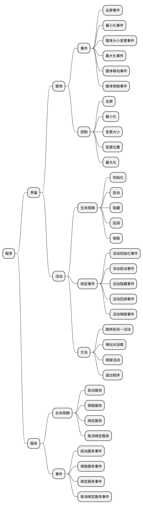

# 设计

```plantuml
@startmindmap

+ 程序
++ 界面
+++ 窗体
' ++++ 边框
' +++++ 系统边框
' +++++ 自定义边框
++++ 事件
+++++ 全屏事件
+++++ 最小化事件
+++++ 窗体大小变更事件
+++++ 最大化事件
+++++ 窗体移动事件
+++++ 窗体销毁事件
++++ 控制
+++++ 全屏
+++++ 最小化
+++++ 变更大小
+++++ 变更位置
+++++ 最大化
+++ 活动
++++ 生命周期
+++++ 初始化
+++++ 启动
+++++ 隐藏
+++++ 回调
+++++ 销毁
++++ 绑定事件
+++++ 活动初始化事件
+++++ 活动启动事件
+++++ 活动隐藏事件
+++++ 活动回调事件
+++++ 活动销毁事件
++++ 方法
+++++ 跳转到另一活动
+++++ 弹出对话框
+++++ 销毁活动
+++++ 退出程序
++ 服务
+++ 生命周期
++++ 启动服务
++++ 销毁服务
++++ 绑定服务
++++ 取消绑定服务
+++ 事件
++++ 启动服务事件
++++ 销毁服务事件
++++ 绑定服务事件
++++ 取消绑定服务事件

@endmindmap
```
